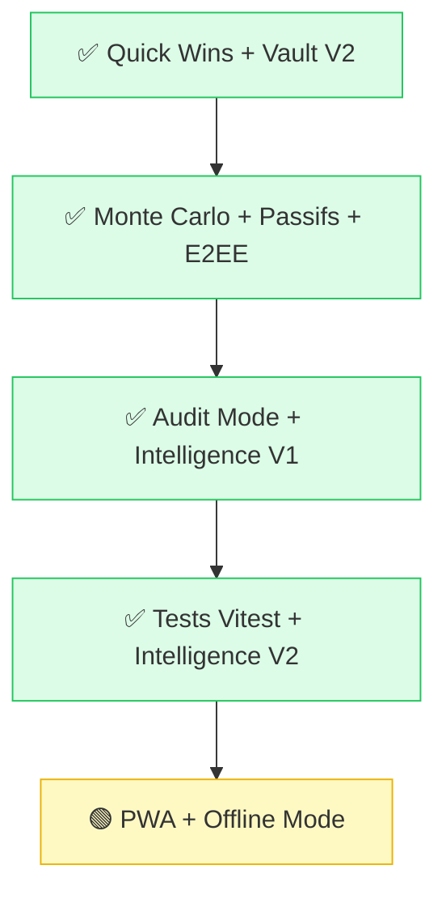

# 🚀 Roadmap : Vision & Évolutions

> Dernière mise à jour : 16 Février 2026 — Post Phase 13 (Deconstructed main.ts + E2EE Cloud Sync).

---

## ✅ Terminé — Quick Wins (Phase 10)

- [x] **Multi-Devises Natif** : EUR/USD/BTC temps réel — `currency_manager.ts`
- [x] **Export PDF/CSV** : Rapports mensuels — `export_manager.ts`
- [x] **Micro-animations** : Transitions + glow — `style.css`

## ✅ Terminé — Vault V2 (Phase 11)

- [x] **SafeVault AES-256-GCM** : Chiffrement local — `vault.ts`
- [x] **Export/Import Chiffré** : Format `.vault` — `persistence.ts`
- [x] **UI Coffre-Fort** : Panel + indicateur statut — `index.html`

## ✅ Terminé — Documentation Sprint (Phase 12)

- [x] **Mise à jour complète** : ROADMAP, CHANGELOG, README, TEAM_MANIFEST

## 🟢 En Cours — Core Evolution (Phase 13)

- [x] **Moteur Monte Carlo** : Simulations bootstrap, fan chart, 5 bandes percentiles — `monte_carlo.ts`
- [x] **Gestion des Passifs** : Dettes, crédits immo, prêts — patrimoine net — `liability_manager.ts`
- [x] **Sync Cloud E2EE** : Synchronisation chiffrée Zero-Knowledge entre appareils — `sync_manager.ts`
- [x] **Refactoring `main.ts`** : Découper en modules spécialisés (`dashboard_widgets`, `monte_carlo_ui`, etc.)
---

## ✅ Terminé — Intelligence (Phase 14)

- [x] **Audit Mode Pessimiste** : UI risques et fuites de cash — `intelligence_engine.ts`
- [x] **Scénarios Catastrophe** : Simulation crash -50% — `evolution_chart.ts`
- [x] **Calcul de Runway** : Résilience financière — `dashboard_widgets.ts`

## ✅ Terminé — Excellence Technique (Phase 15)

- [x] **Suite de Tests Vitest** : Couverture complète des moteurs de calcul financiers.
- [x] **Intelligence V2** : Analyse de corrélation et alertes de surexposition — `intelligence_engine.ts`.

## 🟢 Prochaines Étapes — Mobilité & Offline (Phase 17)

- [ ] **PWA Offline** : Service Worker pour usage hors-ligne complet.
- [ ] **Optimisation Mobile** : Refonte des gestes et touch-targets pour usage intensif sur mobile.
- [ ] **Export PDF Pro** : Génération de rapports financiers complets en format PDF.

---

## 📈 Priorisation

